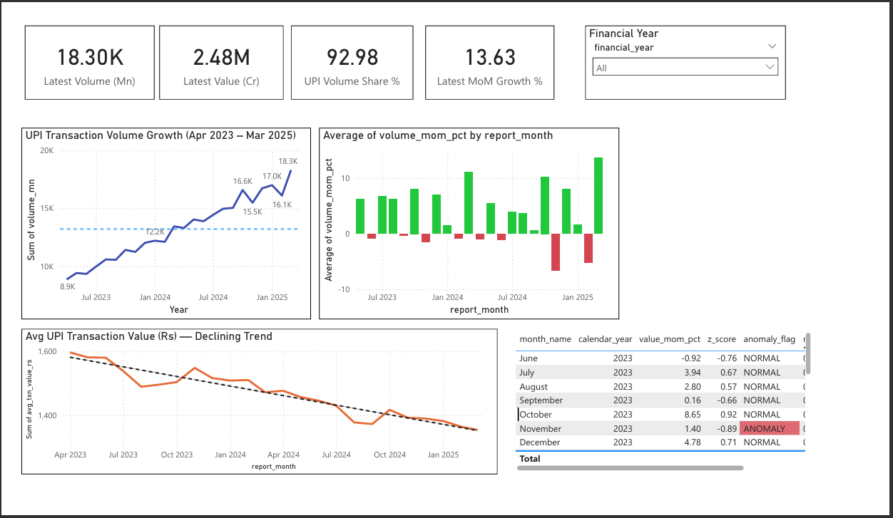
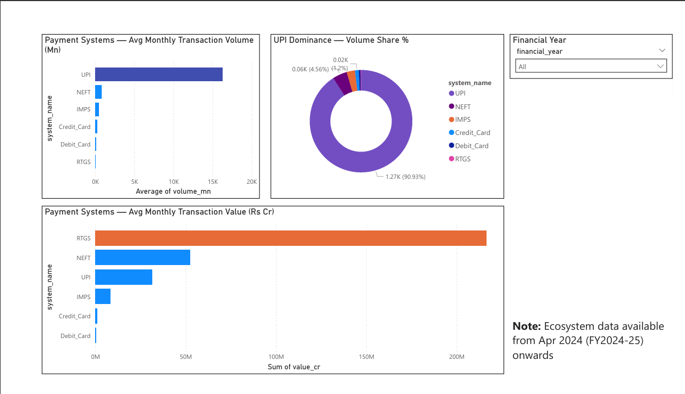
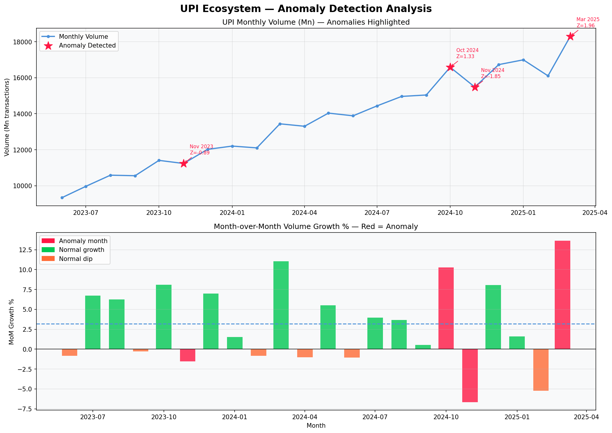

# UPI Ecosystem Health Dashboard 🇮🇳

An end-to-end data analytics project monitoring India's digital 
payment ecosystem using real data from NPCI and RBI.

Built with Python • PostgreSQL • Power BI • Scikit-learn

---

## What This Project Does

India processes 18+ billion UPI transactions per month. This 
project builds a complete analytics pipeline that:

- Ingests real monthly data from NPCI and RBI government reports
- Cleans and transforms it into a PostgreSQL star schema
- Runs Isolation Forest anomaly detection to flag unusual months
- Visualises everything in a 2-page Power BI dashboard

---

## Key Findings

| Metric | Value |
|--------|-------|
| UPI Volume Share | 90.93% of all digital transactions |
| Avg Transaction Value Trend | ₹1,597 → ₹1,353 (declining) |
| Anomalies Detected | 4 months (all seasonally explained) |
| Data Coverage | Apr 2023 – Mar 2025 (24 months) |
| Payment Systems Tracked | UPI, NEFT, IMPS, RTGS, Cards |

**The Paradox:** UPI handles 91% of transactions by COUNT
but only 9% by VALUE. RTGS handles 0.14% of transactions
but 68% of value — because it processes large corporate transfers.

---

## Dashboard Preview

### Page 1 — UPI Growth


### Page 2 — Payment Ecosystem


### Anomaly Detection Output


---

## Architecture
```
NPCI Excel Reports  ──►
RBI Excel Reports   ──►  Python ETL  ──►  PostgreSQL  ──►  Power BI
Inc42 News          ──►  Pipeline        Star Schema       Dashboard
                              │
                              ▼
                    Isolation Forest
                    Anomaly Detection
```

---

## Tech Stack

| Layer | Technology | Purpose |
|-------|-----------|---------|
| Data Collection | Python, openpyxl, pandas | Parse govt Excel files |
| Storage | PostgreSQL 18 | Star schema database |
| Analysis | SQL (CTEs, window functions) | Growth metrics, market share |
| ML | scikit-learn (Isolation Forest) | Anomaly detection |
| Visualisation | Power BI Desktop | Interactive dashboard |
| Environment | Python 3.12, venv | Dependency isolation |

---

## Project Structure
```
upi-ecosystem-dashboard/
├── data/
│   ├── raw/pdfs/          ← NPCI + RBI Excel files (not in repo)
│   └── processed/         ← Cleaned CSVs + anomaly results
├── scripts/
│   ├── data_cleaner.py    ← ETL pipeline
│   ├── db_loader.py       ← PostgreSQL loader
│   ├── anomaly_detector.py← ML anomaly detection
│   └── news_scraper.py    ← Inc42 news scraper
├── db/
│   ├── schema.sql         ← Database schema
│   └── queries.sql        ← Analysis queries
├── dashboards/
│   └── upi_dashboard.pbix ← Power BI file
├── assets/                ← Dashboard screenshots
├── .env.example           ← Credentials template
├── requirements.txt       ← Python dependencies
└── README.md
```

---

## How to Run This Project

### Prerequisites
- Python 3.12+
- PostgreSQL 18+
- Power BI Desktop (free)

### Step 1 — Clone and Setup
```bash
git clone https://github.com/Daksh159/upi-ecosystem-dashboard
cd upi-ecosystem-dashboard
python -m venv venv
venv\Scripts\activate        # Windows
pip install -r requirements.txt
```

### Step 2 — Configure Database
```bash
cp .env.example .env
# Edit .env with your PostgreSQL credentials
```

Create the database in PostgreSQL:
```sql
CREATE DATABASE upi_dashboard;
```

Run the schema:
```bash
psql -U postgres -d upi_dashboard -f db/schema.sql
```

### Step 3 — Download Data

Download these files and place in `data/raw/pdfs/`:
- NPCI UPI Monthly Statistics (2023-24, 2024-25)
  → https://www.npci.org.in/what-we-do/upi/product-statistics
- RBI Payment System Indicators (monthly, FY2024-25)
  → https://www.rbi.org.in/Scripts/Statistics.aspx

### Step 4 — Run the Pipeline
```bash
# Clean and process data
python scripts/data_cleaner.py

# Load into PostgreSQL
python scripts/db_loader.py

# Run anomaly detection
python scripts/anomaly_detector.py
```

### Step 5 — Open Dashboard

Open `dashboards/upi_dashboard.pbix` in Power BI Desktop.
Update the data source to point to your PostgreSQL instance.

---

## SQL Highlights

Window function for MoM growth detection:
```sql
SELECT
    d.report_month,
    f.volume_mn,
    f.volume_mom_pct,
    ROUND(
        (f.volume_mom_pct - AVG(f.volume_mom_pct) OVER()) /
        NULLIF(STDDEV(f.volume_mom_pct) OVER(), 0),
        2
    ) AS z_score
FROM fact_upi_monthly f
JOIN dim_date d ON f.date_id = d.date_id
ORDER BY d.report_month;
```

---

## Anomaly Detection Methodology

Uses **Isolation Forest** with 5 engineered features:
- `volume_mom_pct` — month-over-month volume change
- `value_mom_pct` — month-over-month value change
- `vol_val_divergence` — gap between volume and value growth
- `avg_txn_delta` — change in average transaction size
- `fy_position` — position in Indian financial year (seasonality)

All 4 detected anomalies have known business explanations
(Diwali festival, financial year-end) — confirming UPI growth
is consistent and predictable outside seasonal events.

---

## Data Sources

| Source | Data | URL |
|--------|------|-----|
| NPCI | Monthly UPI Statistics | npci.org.in |
| RBI | Payment System Indicators | rbi.org.in |

*Data used for educational and portfolio purposes only.*

---

## Author

**Daksh Goyal**
Third year Engineering Student — CS + Data Science
Target: Data Analyst / AIML roles
